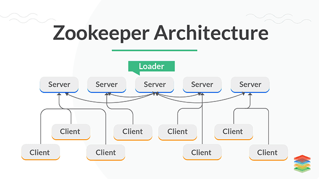
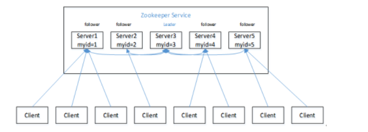
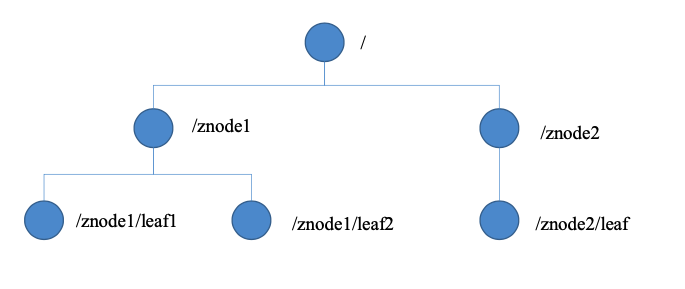

# Zookeeper

#### Overview
- open source, provide coordination service for apache distribution project
- observer design pattern, store and manage sensitive common data
    + service A register into zookeeper
    + service B retrieve service list
    + zookeeper receive status change from service
    + zookeeper notify service B
- file storage + notification mechanism



#### Architecture
- one leader, multiple follower
- more than half node works to live cluster
- each node contains data copy
- request from same client execute in sequence
- transaction atomic

- similar to unix file system
- node is ZNode, store maximum 1MB data


#### Scenario
- Naming service
- Configuration service
    + all the configuration are same
    + CP, configuration synchronized in realtime
    + zookeeper notify client once configuration change
- Cluster service
    + monitor ZNode status
- Load balance: balance workload to less request service
#### Configuration
```properties
# The number of milliseconds of each tick
tickTime=2000
# The number of ticks that the initial 
# synchronization phase can take
# 10 * 2 = 20s, initialization time limit for leader and follower
initLimit=10
# The number of ticks that can pass between 
# sending a request and getting an acknowledgement
# 5 * 2 = 10s, time limit for leader and follower after initialization
syncLimit=5
dataDir=~/Programs/zookeeper-3.4.14/zkData
# the port at which the clients will connect
clientPort=2181
```
#### Command
```shell script
# server
./zkServer.sh start
./zkServer.sh status
./zkServer.sh stop

# client
./zkCli.sh


# show all command
[zk: localhost:2181(CONNECTED) 1] help
# list znode context
[zk: localhost:2181(CONNECTED) 0] ls /
# list current znode details
[zk: localhost:2181(CONNECTED) 1] ls2 /
[zookeeper]
cZxid = 0x0
ctime = Thu Jan 01 08:00:00 CST 1970
mZxid = 0x0
mtime = Thu Jan 01 08:00:00 CST 1970
pZxid = 0x0
cversion = -1
dataVersion = 0
aclVersion = 0
ephemeralOwner = 0x0
dataLength = 0
numChildren = 1
# create node
[zk: localhost:2181(CONNECTED) 3] create /sanguo "jinlian"
Created /sanguo
[zk: localhost:2181(CONNECTED) 4] create /sanguo/shuguo "liubei"
Created /sanguo/shuguo
6．获得节点的值
[zk: localhost:2181(CONNECTED) 5] get /sanguo
jinlian
cZxid = 0x100000003
ctime = Wed Aug 29 00:03:23 CST 2018
mZxid = 0x100000003
mtime = Wed Aug 29 00:03:23 CST 2018
pZxid = 0x100000004
cversion = 1
dataVersion = 0
aclVersion = 0
ephemeralOwner = 0x0
dataLength = 7
numChildren = 1
[zk: localhost:2181(CONNECTED) 6]
[zk: localhost:2181(CONNECTED) 6] get /sanguo/shuguo
liubei
cZxid = 0x100000004
ctime = Wed Aug 29 00:04:35 CST 2018
mZxid = 0x100000004
mtime = Wed Aug 29 00:04:35 CST 2018
pZxid = 0x100000004
cversion = 0
dataVersion = 0
aclVersion = 0
ephemeralOwner = 0x0
dataLength = 6
numChildren = 0
# create Ephemeral node
[zk: localhost:2181(CONNECTED) 7] create -e /sanguo/wuguo "zhouyu"
Created /sanguo/wuguo
# crete node sequence
[zk: localhost:2181(CONNECTED) 1] create /sanguo/weiguo "caocao"
Created /sanguo/weiguo
[zk: localhost:2181(CONNECTED) 2] create -s /sanguo/weiguo/xiaoqiao "jinlian"
Created /sanguo/weiguo/xiaoqiao0000000000
[zk: localhost:2181(CONNECTED) 3] create -s /sanguo/weiguo/daqiao "jinlian"
Created /sanguo/weiguo/daqiao0000000001
# update node
[zk: localhost:2181(CONNECTED) 6] set /sanguo/weiguo "simayi"
# watch node
[zk: localhost:2181(CONNECTED) 26] [zk: localhost:2181(CONNECTED) 8] get /sanguo watch
# watch path
[zk: localhost:2181(CONNECTED) 1] ls /sanguo watch
# delete node
[zk: localhost:2181(CONNECTED) 4] delete /sanguo/jin
# delete recursively 
[zk: localhost:2181(CONNECTED) 15] rmr /sanguo/shuguo
# status
[zk: localhost:2181(CONNECTED) 17] stat /sanguo
cZxid = 0x100000003
ctime = Wed Aug 29 00:03:23 CST 2018
mZxid = 0x100000011
mtime = Wed Aug 29 00:21:23 CST 2018
pZxid = 0x100000014
cversion = 9
dataVersion = 1
aclVersion = 0
ephemeralOwner = 0x0
dataLength = 4
numChildren = 1
```
#### Cluster
- create service id
- add cluster config
- server.A=B:C:D
   + A: service id
   + B: node IP
   + C: leader port
   + D: follower port
```shell script
[atguigu@hadoop102 zookeeper-3.4.10]$ mkdir -p zkData
[atguigu@hadoop102 zkData]$ touch myid
[atguigu@hadoop102 zkData]$ vi myid
2

[atguigu@hadoop102 conf]$ vim zoo.cfg
dataDir=/opt/module/zookeeper-3.4.10/zkData
#######################cluster##########################
server.2=hadoop102:2888:3888
server.3=hadoop103:2888:3888
server.4=hadoop104:2888:3888

[atguigu@hadoop102 zookeeper-3.4.10]$ bin/zkServer.sh start
[atguigu@hadoop103 zookeeper-3.4.10]$ bin/zkServer.sh start
[atguigu@hadoop104 zookeeper-3.4.10]$ bin/zkServer.sh start
[atguigu@hadoop102 zookeeper-3.4.10]# bin/zkServer.sh status
JMX enabled by default
Using config: /opt/module/zookeeper-3.4.10/bin/../conf/zoo.cfg
Mode: follower
[atguigu@hadoop103 zookeeper-3.4.10]# bin/zkServer.sh status
JMX enabled by default
Using config: /opt/module/zookeeper-3.4.10/bin/../conf/zoo.cfg
Mode: leader
[atguigu@hadoop104 zookeeper-3.4.5]# bin/zkServer.sh status
JMX enabled by default
Using config: /opt/module/zookeeper-3.4.10/bin/../conf/zoo.cfg
Mode: follower
```
#### Election
- half number mechanism: odd number node cluster is recommendation
- internal node elect leader
    + server 1 elect 1
    + server 2 elect 2, server 1 elect 2 since 2 is greater
    + server 3 elect 3, server 1/2 elect 3, server 3 become leader
    + server 4 joins
    + server 5 joins
#### Node 
- Persistent
    + service disconnect, node is not delete
    + service disconnect, node is not delete but add sequence number into ID
- Ephemeral: service disconnect, node is delete
#### Stat
- czxid: znode transaction
- ctime: znode created time
- mzxid: znode last update time
- mtime: znode last modification time
- ephemeralOwner: zonde session id
#### Notification
- zkClient start main
- create two thread for connecting and listener
- send the watch event to zookeeper
- zookeeper register event to watch list
- zookeeper notify zkClient listener if data change
- listener execute process()
- event: get path watch, ls path watch

